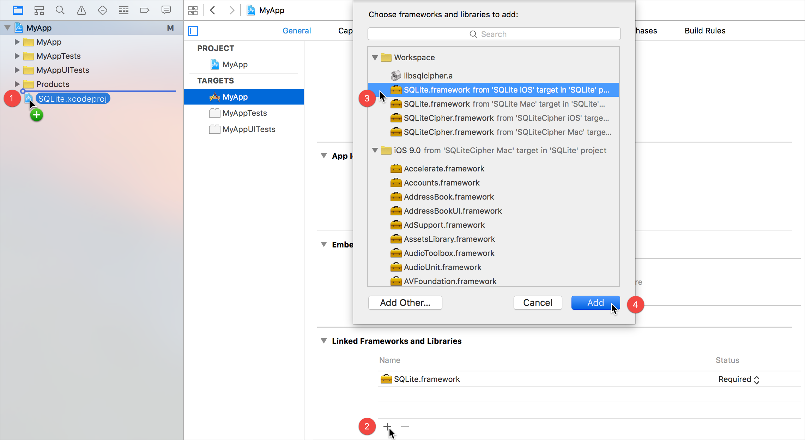

# SQLite.swift

A type-safe, [Swift][]-language layer over [SQLite3][].

[SQLite.swift][] provides compile-time confidence in SQL statement
syntax _and_ intent.

[Swift]: https://developer.apple.com/swift/
[SQLite3]: http://www.sqlite.org
[SQLite.swift]: https://github.com/stephencelis/SQLite.swift


## Features

 - A pure-Swift interface
 - A type-safe, optional-aware SQL expression builder
 - A flexible, chainable, lazy-executing query layer
 - Automatically-typed data access
 - A lightweight, uncomplicated query and parameter binding interface
 - Transactions with implicit commit/rollback
 - Developer-friendly error handling and debugging
 - [Full-text search][] support
 - [SQLCipher](#sqlcipher) support
 - [Well-documented][See Documentation]
 - Extensively tested

[Full-text search]: Documentation/Index.md#full-text-search
[See Documentation]: Documentation/Index.md#sqliteswift-documentation


## Usage

``` swift
import SQLite

let db = Database("path/to/db.sqlite3")

let users = db["users"]
let id = Expression<Int64>("id")
let name = Expression<String?>("name")
let email = Expression<String>("email")

db.create(table: users) { t in
    t.column(id, primaryKey: true)
    t.column(name)
    t.column(email, unique: true)
}
// CREATE TABLE "users" (
//     "id" INTEGER PRIMARY KEY NOT NULL,
//     "name" TEXT,
//     "email" TEXT NOT NULL UNIQUE
// )

var alice: Query?
if let insertId = users.insert(name <- "Alice", email <- "alice@mac.com") {
    println("inserted id: \(insertId)")
    // inserted id: 1
    alice = users.filter(id == insertId)
}
// INSERT INTO "users" ("name", "email") VALUES ('Alice', 'alice@mac.com')

for user in users {
    println("id: \(user[id]), name: \(user[name]), email: \(user[email])")
    // id: 1, name: Optional("Alice"), email: alice@mac.com
}
// SELECT * FROM "users"

alice?.update(email <- replace(email, "mac.com", "me.com"))?
// UPDATE "users" SET "email" = replace("email", 'mac.com', 'me.com')
// WHERE ("id" = 1)

alice?.delete()?
// DELETE FROM "users" WHERE ("id" = 1)

users.count
// SELECT count(*) FROM "users"
```

SQLite.swift also works as a lightweight, Swift-friendly wrapper over the C
API.

``` swift
let stmt = db.prepare("INSERT INTO users (email) VALUES (?)")
for email in ["betty@icloud.com", "cathy@icloud.com"] {
    stmt.run(email)
}

db.totalChanges // 3
db.lastChanges  // 1
db.lastId       // 3

for row in db.prepare("SELECT id, email FROM users") {
    println("id: \(row[0]), email: \(row[1])")
    // id: Optional(2), email: Optional("betty@icloud.com")
    // id: Optional(3), email: Optional("cathy@icloud.com")
}

db.scalar("SELECT count(*) FROM users") // 2
```

[Read the documentation][See Documentation] or explore more,
interactively, from the Xcode project’s playground.


## Installation

> _Note:_ SQLite.swift requires Swift 1.1 (and [Xcode][] 6.1) or
> greater.
>
> For the Swift 1.2 beta (included in Xcode 6.3), use the
> [`swift-1-2`](https://github.com/stephencelis/SQLite.swift/tree/swift-1-2)
> branch.
>
> The following instructions apply to targets that support embedded
> Swift frameworks. To use SQLite.swift in iOS 7 or an OS X command line
> tool, please read the [Frameworkless Targets][] section of the
> documentation.

To install SQLite.swift:

 1. Drag the **SQLite.xcodeproj** file into your own project.
    ([Submodule][], clone, or [download][] the project first.)

    

 2. In your target’s **Build Phases**, add **SQLite** to the **Target
    Dependencies** build phase.

 3. Add **SQLite.framework** to the **Link Binary With Libraries** build
    phase.

 4. Add **SQLite.framework** to a **Copy Files** build phase with a
    **Frameworks** destination. (Add a new build phase if need be.)

[Frameworkless Targets]: Documentation/Index.md#frameworkless-targets
[Xcode]: https://developer.apple.com/xcode/downloads/
[Submodule]: http://git-scm.com/book/en/Git-Tools-Submodules
[download]: https://github.com/stephencelis/SQLite.swift/archive/master.zip


### SQLCipher

To install SQLite.swift with [SQLCipher][] support:

 1. Make sure the **sqlcipher** working copy is checked out in Xcode. If
    **sqlcipher.xcodeproj** (in the **Vendor** group) is unavailable
    (and appears red), go to the **Source Control** menu and select
    **Check Out sqlcipher…** from the **sqlcipher** menu item.

 2. Follow [the instructions above](#installation) with the
    **SQLiteCipher** target, instead.

> _Note:_ By default, SQLCipher compiles [without support for full-text
> search][]. If you intend to use [FTS4][], make sure you add the
> following to **Other C Flags** in the **Build Settings** of the
> **sqlcipher** target (in the **sqlcipher.xcodeproj** project):
>
>  - `-DSQLITE_ENABLE_FTS4`
>  - `-DSQLITE_ENABLE_FTS3_PARENTHESIS`

[SQLCipher]: http://sqlcipher.net
[without support for full-text search]: https://github.com/sqlcipher/sqlcipher/issues/102
[FTS4]: http://www.sqlite.org/fts3.html


## Communication

 - Need **help** or have a **general question**? [Ask on Stack
   Overflow][] (tag `sqlite.swift`).
 - Found a **bug** or have a **feature request**? [Open an issue][].
 - Want to **contribute**? [Submit a pull request][].

[Ask on Stack Overflow]: http://stackoverflow.com/questions/tagged/sqlite.swift
[Open an issue]: https://github.com/stephencelis/SQLite.swift/issues/new
[Submit a pull request]: https://github.com/stephencelis/SQLite.swift/fork


## Author

 - [Stephen Celis](mailto:stephen@stephencelis.com)
   ([@stephencelis](https://twitter.com/stephencelis))


## License

SQLite.swift is available under the MIT license. See [the LICENSE
file](./LICENSE.txt) for more information.


## Alternatives

Looking for something else? Try another Swift wrapper (or [FMDB][]):

 - [Camembert](https://github.com/remirobert/Camembert)
 - [EonilSQLite3](https://github.com/Eonil/SQLite3)
 - [SQLiteDB](https://github.com/FahimF/SQLiteDB)
 - [Squeal](https://github.com/nerdyc/Squeal)
 - [SwiftData](https://github.com/ryanfowler/SwiftData)
 - [SwiftSQLite](https://github.com/chrismsimpson/SwiftSQLite)

[FMDB]: https://github.com/ccgus/fmdb
