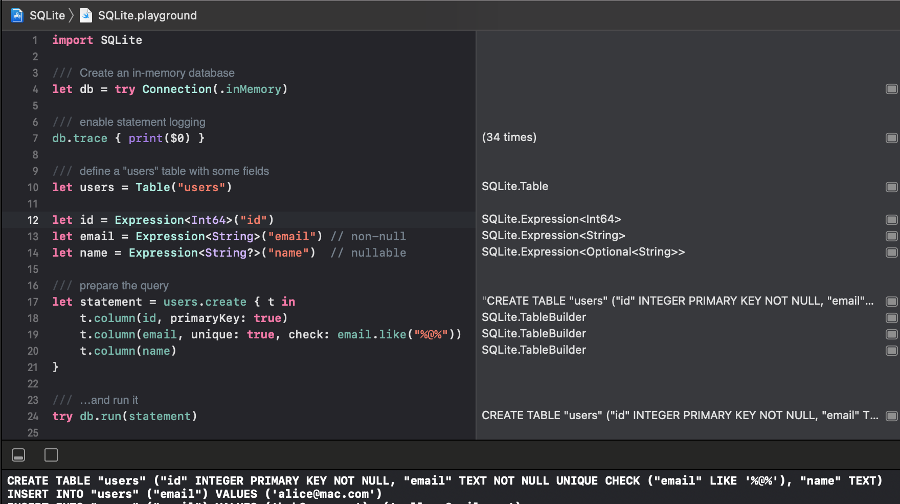

# SQLite.swift [![Build Status][Badge]][Travis]

A type-safe, [Swift][]-language layer over [SQLite3][].

[SQLite.swift][] provides compile-time confidence in SQL statement
syntax _and_ intent.

[Badge]: https://img.shields.io/travis/stephencelis/SQLite.swift/master.svg?style=flat
[Travis]: https://travis-ci.org/stephencelis/SQLite.swift
[Swift]: https://developer.apple.com/swift/
[SQLite3]: http://www.sqlite.org
[SQLite.swift]: https://github.com/stephencelis/SQLite.swift


## Features

 - A pure-Swift interface
 - A type-safe, optional-aware SQL expression builder
 - A flexible, chainable, lazy-executing query layer
 - Automatically-typed data access
 - A lightweight, uncomplicated query and parameter binding interface
 - Developer-friendly error handling and debugging
 - [Full-text search][] support
 - [SQLCipher](#sqlcipher) support
 - [Well-documented][See Documentation]
 - Extensively tested

[Full-text search]: Documentation/Index.md#full-text-search
[See Documentation]: Documentation/Index.md#sqliteswift-documentation


## Usage

``` swift
import SQLite

let db = try Connection("path/to/db.sqlite3")

let users = Table("users")
let id = Expression<Int64>("id")
let name = Expression<String?>("name")
let email = Expression<String>("email")

try db.run(users.create { t in
    t.column(id, primaryKey: true)
    t.column(name)
    t.column(email, unique: true)
})
// CREATE TABLE "users" (
//     "id" INTEGER PRIMARY KEY NOT NULL,
//     "name" TEXT,
//     "email" TEXT NOT NULL UNIQUE
// )

let insert = users.insert(name <- "Alice", email <- "alice@mac.com")
let rowid = try db.run(insert)
// INSERT INTO "users" ("name", "email") VALUES ('Alice', 'alice@mac.com')

for user in try db.prepare(users) {
    print("id: \(user[id]), name: \(user[name]), email: \(user[email])")
    // id: 1, name: Optional("Alice"), email: alice@mac.com
}
// SELECT * FROM "users"

let alice = users.filter(id == rowid)

try db.run(alice.update(email <- email.replace("mac.com", with: "me.com")))
// UPDATE "users" SET "email" = replace("email", 'mac.com', 'me.com')
// WHERE ("id" = 1)

try db.run(alice.delete())
// DELETE FROM "users" WHERE ("id" = 1)

db.scalar(users.count) // 0
// SELECT count(*) FROM "users"
```

SQLite.swift also works as a lightweight, Swift-friendly wrapper over the C
API.

``` swift
let stmt = try db.prepare("INSERT INTO users (email) VALUES (?)")
for email in ["betty@icloud.com", "cathy@icloud.com"] {
    try stmt.run(email)
}

db.totalChanges    // 3
db.changes         // 1
db.lastInsertRowid // 3

for row in try db.prepare("SELECT id, email FROM users") {
    print("id: \(row[0]), email: \(row[1])")
    // id: Optional(2), email: Optional("betty@icloud.com")
    // id: Optional(3), email: Optional("cathy@icloud.com")
}

db.scalar("SELECT count(*) FROM users") // 2
```

[Read the documentation][See Documentation] or explore more,
interactively, from the Xcode project’s playground.




## Installation

> _Note:_ SQLite.swift requires Swift 2 (and [Xcode][] 7) or greater.
>
> The following instructions apply to targets that support embedded
> Swift frameworks. To use SQLite.swift in iOS 7 or an OS X command line
> tool, please read the [Frameworkless Targets][] section of the
> documentation.


### Carthage

[Carthage][] is a simple, decentralized dependency manager for Cocoa. To
install SQLite.swift with Carthage:

 1. Make sure Carthage is [installed][Carthage Installation].

 2. Update your Cartfile to include the following:

    ```
    github "stephencelis/SQLite.swift" "master"
    ```

 3. Run `carthage update` and [add the appropriate framework][Carthage Usage].


[Carthage]: https://github.com/Carthage/Carthage
[Carthage Installation]: https://github.com/Carthage/Carthage#installing-carthage
[Carthage Usage]: https://github.com/Carthage/Carthage#adding-frameworks-to-an-application


### CocoaPods

[CocoaPods][] is a dependency manager for Cocoa projects. To install
SQLite.swift with CocoaPods:

 1. Make sure CocoaPods is [installed][CocoaPods Installation]. (SQLite.swift
    requires version 0.37 or greater.)

 2. Update your Podfile to include the following:

    ``` ruby
    use_frameworks!

    pod 'SQLite.swift',
      git: 'https://github.com/stephencelis/SQLite.swift.git'

    # instead, for SQLCipher support
    pod 'SQLiteCipher.swift',
      git: 'https://github.com/stephencelis/SQLite.swift.git'
    ```

 3. Run `pod install`.

[CocoaPods]: https://cocoapods.org
[CocoaPods Installation]: https://guides.cocoapods.org/using/getting-started.html#getting-started


### Manual

To install SQLite.swift as an Xcode sub-project:

 1. Drag the **SQLite.xcodeproj** file into your own project.
    ([Submodule][], clone, or [download][] the project first.)

    

 2. In your target’s **General** tab, click the **+** button under **Linked
    Frameworks and Libraries**.

 3. Select the appropriate **SQLite.framework** for your platform.

 4. **Add**.

[Frameworkless Targets]: Documentation/Index.md#frameworkless-targets
[Xcode]: https://developer.apple.com/xcode/downloads/
[Submodule]: http://git-scm.com/book/en/Git-Tools-Submodules
[download]: https://github.com/stephencelis/SQLite.swift/archive/master.zip


#### SQLCipher

> _Note_: To install with CocoaPods, [see above](#cocoapods).

To install SQLite.swift with [SQLCipher][] support:

 1. Make sure the **sqlcipher** working copy is checked out in Xcode. If
    **sqlcipher.xcodeproj** is unavailable (_i.e._, it appears red), go to the
    **Source Control** menu and select **Check Out sqlcipher…** from the
    **sqlcipher** menu item.

 2. Follow [the instructions above](#manual) with the **SQLiteCipher** target,
    instead.

> _Note:_ By default, SQLCipher compiles [without support for full-text
> search][]. If you intend to use [FTS4][], make sure you add the
> following to **Other C Flags** in the **Build Settings** of the
> **sqlcipher** target (in the **sqlcipher.xcodeproj** project):
>
>  - `-DSQLITE_ENABLE_FTS4`
>  - `-DSQLITE_ENABLE_FTS3_PARENTHESIS`

[SQLCipher]: http://sqlcipher.net
[without support for full-text search]: https://github.com/sqlcipher/sqlcipher/issues/102
[FTS4]: http://www.sqlite.org/fts3.html


## Communication

[Read the contributing guidelines][]. The _TL;DR_ (but please; _R_):

 - Need **help** or have a **general question**? [Ask on Stack
   Overflow][] (tag `sqlite.swift`).
 - Found a **bug** or have a **feature request**? [Open an issue][].
 - Want to **contribute**? [Submit a pull request][].

[Read the contributing guidelines]: ./CONTRIBUTING.md#contributing
[Ask on Stack Overflow]: http://stackoverflow.com/questions/tagged/sqlite.swift
[Open an issue]: https://github.com/stephencelis/SQLite.swift/issues/new
[Submit a pull request]: https://github.com/stephencelis/SQLite.swift/fork


## Author

 - [Stephen Celis](mailto:stephen@stephencelis.com)
   ([@stephencelis](https://twitter.com/stephencelis))


## License

SQLite.swift is available under the MIT license. See [the LICENSE
file](./LICENSE.txt) for more information.


## Alternatives

Looking for something else? Try another Swift wrapper (or [FMDB][]):

 - [Camembert](https://github.com/remirobert/Camembert)
 - [EonilSQLite3](https://github.com/Eonil/SQLite3)
 - [SQLiteDB](https://github.com/FahimF/SQLiteDB)
 - [Squeal](https://github.com/nerdyc/Squeal)
 - [SwiftData](https://github.com/ryanfowler/SwiftData)
 - [SwiftSQLite](https://github.com/chrismsimpson/SwiftSQLite)

[FMDB]: https://github.com/ccgus/fmdb
